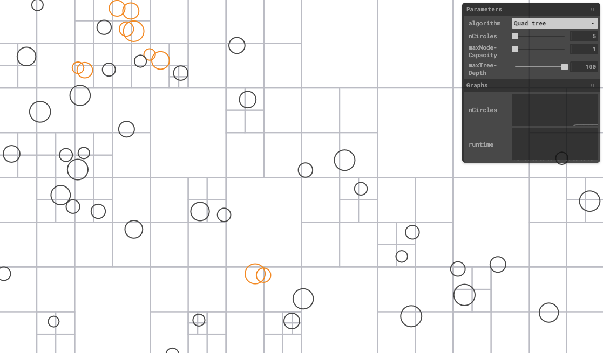

# Quadtree collision

Visualization of quadtree collision detection algorithm.

## Algorithm

- Rebuild tree at every step 
- Retrieve a list of collision candidates
- Calculate if those candidates collide
- Perform update logic ...

### Parameters
- node capacity - maximum number of items in any given sub-quadrant 
- max tree depth - maximum quad tree depth

## 📚 Resources

- [Mike Chambers - JavaScript QuadTree Implementation](http://www.mikechambers.com/blog/2011/03/21/javascript-quadtree-implementation/)
- [Game Development - Use QuadTrees to detect likely collisions](https://gamedevelopment.tutsplus.com/tutorials/quick-tip-use-quadtrees-to-detect-likely-collisions-in-2d-space--gamedev-374)
- [Tyler Scott - Quadtrees and Octrees for Representing Spatial Information](https://www.youtube.com/watch?v=xFcQaig5Z2A)
- [Dev.Mag quadtrees implementation](http://devmag.org.za/2011/02/23/quadtrees-implementation/)
- [Geometry in Action - Quadtrees and Hierarchical Space Decomposition](https://www.ics.uci.edu/~eppstein/gina/quadtree.html)
